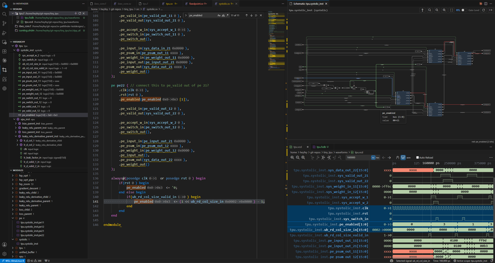
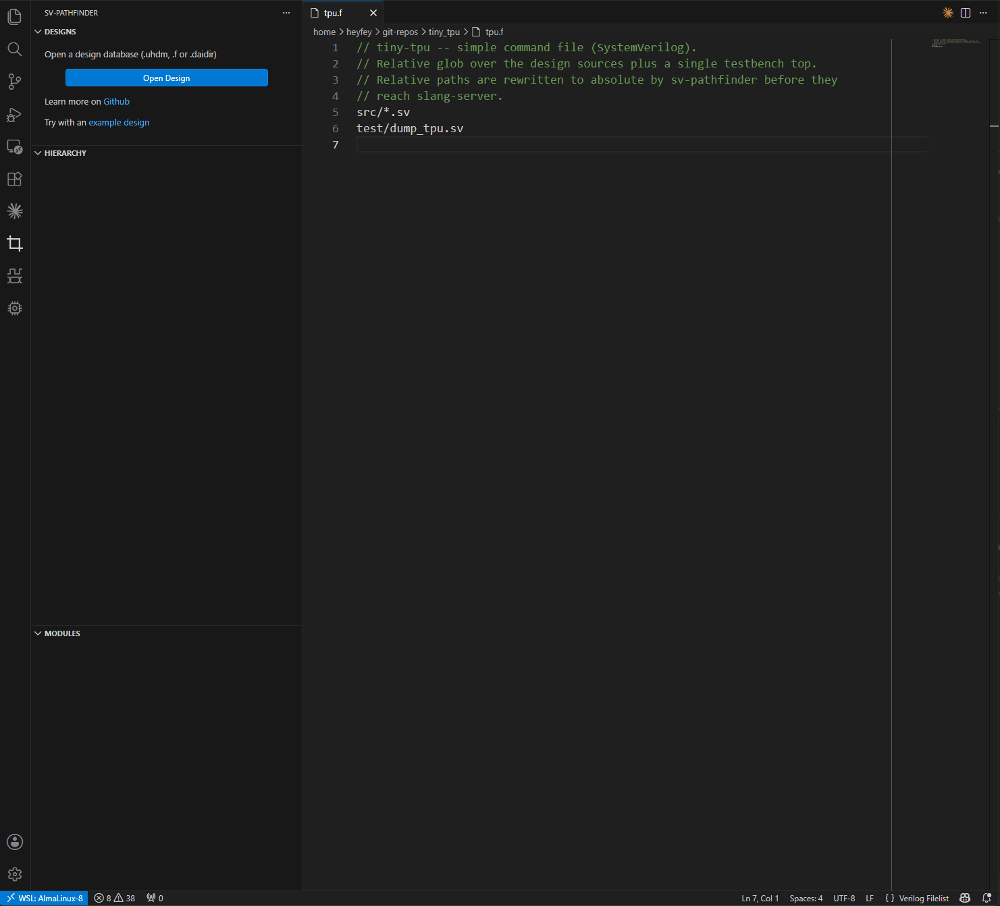
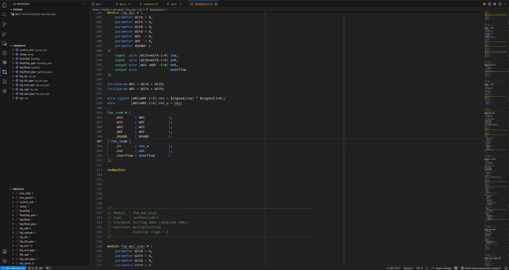
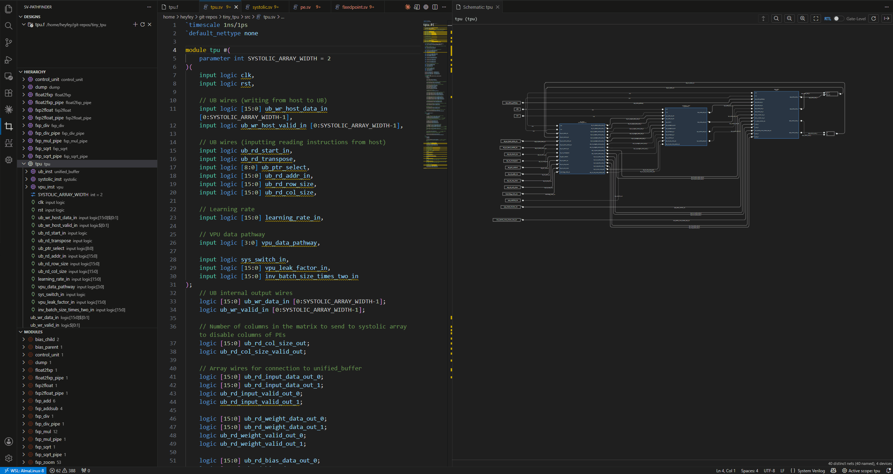

# sv-pathfinder

VS Code extension for SystemVerilog design navigation, RTL tracing, schematic viewer, and waveform integration with the [Vaporview](https://github.com/Lramseyer/vaporview) waveform viewer.

[VS Code Marketplace](https://marketplace.visualstudio.com/items?itemName=heyfey.sv-pathfinder) | Open VSX | [GitHub](https://github.com/heyfey/sv-pathfinder)

> **[Getting Started](GETTING_STARTED.md)** walks through prerequisites,
> setup, and opening your first design.

## Features

### Navigate a design

- Browse the elaborated design hierarchy
- Jump to source: module definitions/instantiations, signal
declarations, generate blocks, and more
- Go back/forward
- Find instance
- Select an instance from the Modules view
- Waveform value & add to waveform ([waveform integration](#waveform-integration))

> **Setup & details → [Open a design](GETTING_STARTED.md#open-a-design)**.

### Schematic viewer

- Render the RTL (or gate-level) structure of any scope
- Right-click a scope → **Show Schematic**
- Step into child scope / Step out to parent scope
- Jump to source editor for cell/wire
- Find in schematic viewer
- Waveform value & add to waveform ([waveform integration](#waveform-integration))

> **Setup & details → [SCHEMATIC.md](SCHEMATIC.md)**.

### Waveform integration

With the [Vaporview](https://marketplace.visualstudio.com/items?itemName=lramseyer.vaporview) extension:

- **Inline signal values** — show signal values in
  the **source editor** and **schematic view**, for the given waveform marker time
- **Add signals to the waveform** — from hierarchy view, source editor, or schematic → **Show in Waveform** / **Add All
  Variables in Scope to Waveform**

## Documentation

- **[Getting Started](GETTING_STARTED.md)** — prerequisites, backends (`.f` / `.uhdm`), opening a
  design, and all settings.
- **[SCHEMATIC.md](SCHEMATIC.md)** — schematic setup (OSS CAD Suite), backend tiers, elaboration
  modes, curated/partial filelists, and all `schematic*` settings.

## Acknowledgements

Many thanks to [@lramseyer](https://github.com/Lramseyer) for Vaporview and the inspiration.
