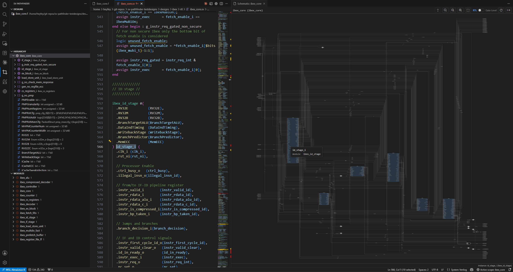

# Schematic Viewer

The schematic renders the RTL (or gate-level) structure of any scope — ports, sub-instances, logic, and wires — elaborated with Yosys



## Setup (OSS CAD Suite)

The schematic needs **Yosys + the `slang` SystemVerilog frontend**, both of which ship in
[OSS CAD Suite](https://github.com/YosysHQ/oss-cad-suite-build):

1. Download the suite for your platform from the
   [releases](https://github.com/YosysHQ/oss-cad-suite-build/releases).
2. Extract it (`tar xzf oss-cad-suite-linux-x64-YYYYMMDD.tgz`).
3. Point the setting at the extracted **`oss-cad-suite`** folder (the one containing `bin/yosys`):
   ```jsonc
   // settings.json
   "sv-pathfinder.ossCadSuitePath": "/path/to/oss-cad-suite"
   ```
4. Right-click a scope in the Hierarchy view → **Show Schematic** to verify.

> **macOS:** OSS CAD Suite's binaries aren't Apple-notarized, so Gatekeeper blocks them on first run
> (*"Apple could not verify 'realpath' is free of malware…"*). Clear the quarantine flag on the whole
> folder once, then reload the window:
> ```bash
> xattr -dr com.apple.quarantine "/path/to/oss-cad-suite"
> ```
> Use the same folder as `sv-pathfinder.ossCadSuitePath`. Don't approve binaries one-by-one in System
> Settings — yosys pulls in several (`realpath`, `abc`, the `slang` plugin, …).

## Backend tiers

- **OSS CAD Suite / any slang-capable Yosys** — full SystemVerilog support via `read_slang`. (Recommended)
- **`yowasp-yosys`** (`pip install yowasp-yosys`) — a zero-install WASM **fallback with major
  SystemVerilog gaps**; many designs render incompletely or fail to elaborate. The schematic shows a
  "limited engine" badge and warns once when it falls back. These failures are a limitation of the
  fallback toolchain, not your design or this extension.
- A plain `yosys` on PATH **without** the slang frontend is **not used** (Verilog-only).

## Elaboration modes (`schematicElaborationMode`)

- **`shallow`** *(default)* — elaborates only the selected scope + one level (children as boxes) and
  re-elaborates the next level on demand as you step in or expand. Cheapest to start on large designs.
- **`full`** — the scope you open is elaborated **once**; rendering it, plus step-into, expand, and
  stepping back up, all come from that single elaboration with no re-elaboration. Only navigating
  *above* what you've opened elaborates again. (Rooting at the opened scope, not the design's absolute
  top, avoids elaborating a non-synthesizable testbench above the DUT.) Best for small/medium designs.

## Curated / partial filelists

Unlike the language server, Yosys needs a **self-contained** filelist. The filelist's own directory
and each source file's directory are searched automatically, so a `.f` that omits sibling modules
(like [ibex](https://github.com/lowrisc/ibex)'s `ibex_core.f`) still resolves them.

- If `` `include`` headers live **outside** the source tree (e.g. ibex's vendored `prim_assert.sv` /
  `dv_fcov_macros.svh`), add their directories to **`sv-pathfinder.schematicIncludeDirs`**. A
  schematic error naming a missing file or unknown module points here.
- **Flip side:** Yosys searches those directories, but the navigation backend sees only the files the
  `.f` lists — so the schematic can show a sub-instance the hierarchy tree doesn't have (e.g. ibex's
  `wb_stage_i`, whose `ibex_wb_stage.sv` is omitted from `ibex_core.f`). **Step into** on such an
  instance can't open its scope; it explains why and offers **Go to source** instead. Add the missing
  source to the `.f` to navigate it fully.

## Schematic settings

| Setting | Description |
|---|---|
| `sv-pathfinder.ossCadSuitePath` | OSS CAD Suite dir (the `bin/yosys` parent). If empty, `yosys` then `yowasp-yosys` are resolved from PATH. |
| `sv-pathfinder.schematicElaborationMode` | `shallow` (default) or `full` — see above. |
| `sv-pathfinder.schematicIncludeDirs` | Extra `` `include`` search dirs for Yosys elaboration. |
| `sv-pathfinder.schematicAccentColor` | Accent color for child-instance fills / hover highlights. Any CSS color; empty = theme-aware default. |
| `sv-pathfinder.schematicShowDanglingNets` | Surface declared-but-unconnected nets. Default off. |
| `sv-pathfinder.schematicSpacing` | Layout density: `compact` / `comfortable` (default) / `spacious`. |
